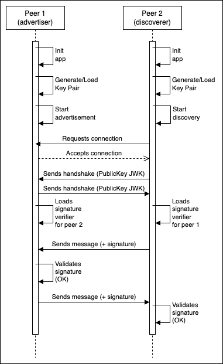

# Nearby Cross

A flutter plugin that uses Google's Nearby Connections to connect devices across multiple operative systems

## Getting Started

Add the dependency: 
```zsh
flutter pub get nearby_cross
```

And follow the steps for working in iOS

1. You need to request the access to protected resources in the following [link](https://developers.google.com/nearby/connections/swift/get-started#request_access_to_protected_resources)
2. Run pod install inside the `ios` folder
3. Open XCode and install nearby using SPM
4. Done!


## Models

### Connector
- functions that are shared between discoverer and advertiser
- Main model managing advertiser and discoverer
- Multiple callbacks define for when an action like a connection or data is being received


```
```

### Advertiser
- The advertiser has the functions to `advertise` and `stopAdvertising` and all the Connector functions
- To advertise you need to indicate the service id for example `com.example.nearbyCrossExample` used in the example app
- Its basically the one starting the network
- You can choose between different strategies:
    - Star
    - Cluster
    - Point To Point

```dart
final advertiser = Advertiser()
/* Future<void> advertise(
  String serviceId, {
  bool manualAcceptConnections = false,
  NearbyStrategies strategy = NearbyStrategies.star,
})
*/
advertiser.startAdvertising('com.example.nearbyCrossExample', false, NearbyStrategies.star)
//
// ... send or receive connections
//
advertiser.stopAdvertising()
```

### Discoverer
- The discoverer that connects to the advertiser, its the one connecting to the advertiser


### ConnectionManager
- This class contains all callbacks generated for in between actions, device disconnected, new data received etc. You must register callback to be executed in every flow you are interested, specially when receiving a message.


## Authenticated connections
This plugin also allows to stablish secure conections using [ECDSA](https://www.nervos.org/knowledge-base/understanding_ECDSA_(explainCKBot)) cryptographic algorithm to generate digital signatures. If you want to include this feature in your application, an `authenticationManager` must be provided to the `ConnectionsManager` instance when creating it for the first time, for example:

```dart
var experimentalAuthManager = ExperimentalAuthManager();
experimentalAuthManager.setIdentifier('test_experimental');
ConnectionsManager(authenticationManager: experimentalAuthManager);
```

This "Authentication Manager" must extend `AuthenticationManager` abstract class:

```dart
abstract class AuthenticationManager {
  /// SiginigManager instance.
  /// It will be used to sign messages before sending it to the connected peer
  late SigningManager signingManager;

  /// Identifier for this device (eg: uuid)
  late String identifier;

  /// Initializer function for this class. It will be executed when ConnectionsManager
  /// is initialized.
  /// Use this to set-up your authentication flow, like setting up the signingManager instance.
  void initialize();

  /// Signs NearbyMessage using signingManager instance
  void sign(NearbyMessage message) {
    message.signMessage(signingManager);
  }

  /// Starts handshake protocol.
  /// This will be executed every new device connection
  void startHandshake(Device device);

  /// Process a handshake message
  /// This will be executed when a NearbyMessageType.handshake message is received
  void processHandshake(Device device, NearbyMessage message);

  /// Sets identifier
  void setIdentifier(String newId);
}
```

### Example for authentication flow
`ExperimentalAuthManager` is an example that implements a possible authentication flow using ECDSA and Handshake protocol:



In experimental mode, public keys are being shared in handshake process during device connection. These public keys are being loaded before stablishing connection and sending messages, and it is later used to verify messages signatures. More complex flows can be implemented using this interface and implementing other types of trustworthy sources to store public keys.

## Example
In the example folder there's a chat implemented utilizing the plugin which you can share messages and stop and start the connection choosing which strategy you want


## More links
- [Nearby Connections GH](https://github.com/google/nearby/tree/main/connections)
- [Nearby Connections Documentation](https://developers.google.com/nearby/connections/overview)

